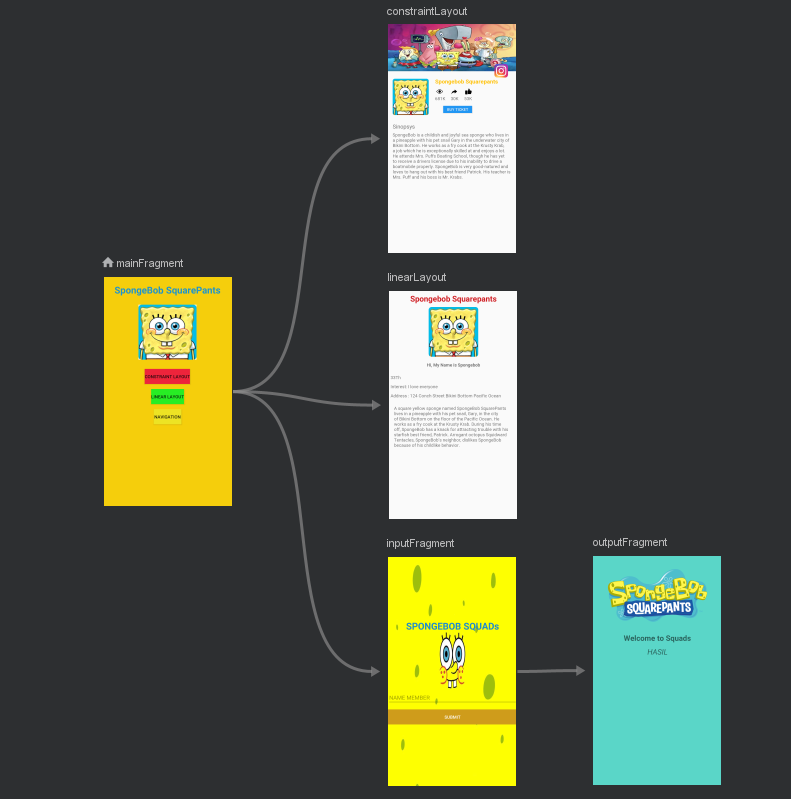
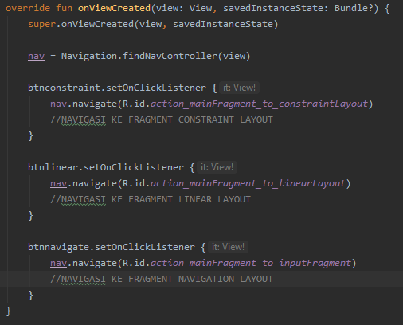
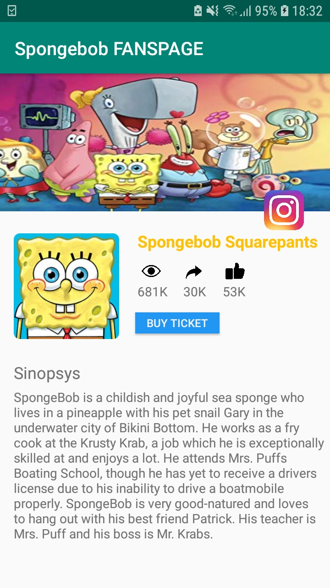

# HASIL RUN APLIKASI

1. ## flow navigasi

2. ## code navigasi

3. ## main fragment

4. ## linear layout fragment

4. ## constraint layout fragment

4. ## navigation layout fragment 1

4. ## navigation layout fragment 2
